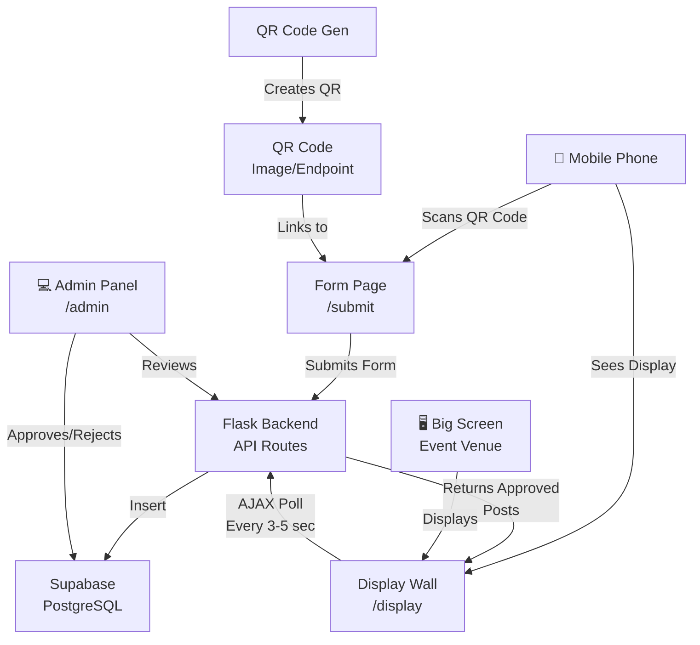
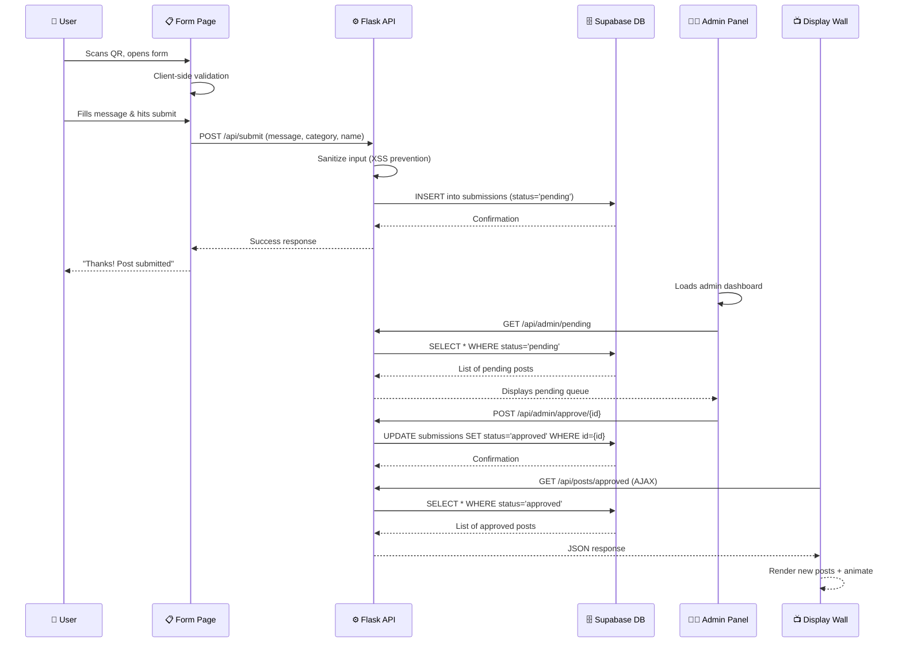
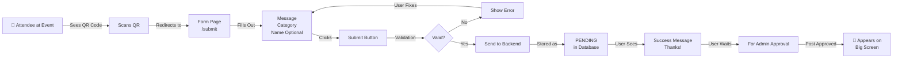
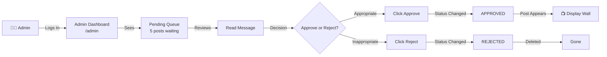
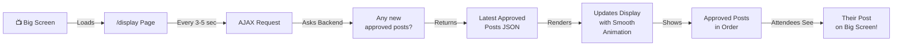

# 🎉 Parageyan Intrams Shoutout/Confession Wall

A real-time web-based platform for sharing shoutouts, confessions, and messages during Parageyan Intrams. Features manual content moderation, live display on event screens, and anonymous submission options.

---

## 📋 Table of Contents

1. [Project Overview](#project-overview)
2. [Tech Stack & Why](#tech-stack--why)
3. [Features](#features)
4. [System Architecture](#system-architecture)
5. [Data Flow](#data-flow)
6. [User Workflows](#user-workflows)
7. [Database Schema](#database-schema)
8. [Project Structure](#project-structure)
9. [API Endpoints](#api-endpoints)
10. [Setup Instructions](#setup-instructions)
11. [Deployment](#deployment)

---

## 🎯 Project Overview

**What it does:**
- Event attendees scan a **QR code** on their phones
- They fill out a form with a **message/shoutout** and optional **name**
- Submissions go to an **admin queue** for moderation (prevent bullying/harsh words)
- Approved posts appear **live on a big screen** at the event venue
- Real-time updates as new posts are approved

**Why it matters:**
- Builds community engagement during the event
- Anonymous option reduces hesitation to share
- Moderation keeps the environment positive and safe
- Attendees see their posts on the big screen = high engagement

---

## 🛠️ Tech Stack & Why

### Backend
- **Flask** (Python web framework)
  - *Why:* Simple, explicit, perfect for learning. No hidden magic. You see exactly what's happening.
  - *What:* Routes, request handling, API responses

### Frontend
- **HTML/CSS/JavaScript** (vanilla, no frameworks)
  - *Why:* Learn how the web works at the core level. Understand DOM manipulation, form handling, AJAX.

### Database
- **SQLite** (Local file-based database)
  - *Why:* Zero setup, no internet needed, perfect for offline. Database is just a `.db` file in your project.
  - *What:* Store submissions, manage statuses, track admin actions
  - *How:* Python's `sqlite3` comes built-in, no extra installation

### Real-time Updates
- **AJAX polling** (for display page) OR **Supabase Realtime**
  - *Why:* AJAX polling is simpler to understand; Supabase Realtime is true real-time but more complex
  - *Recommendation:* Start with AJAX polling (page refreshes every 3-5 sec), upgrade later if needed

### QR Code Generation
- **qrcode** (Python library)
  - *Why:* Generates QR codes dynamically. Attendees just scan to get to the form.

### Deployment
- **Local Network** (during intrams)
  - *How:* Run Flask on one laptop, attendees connect via local IP (192.168.x.x:5000)
  - *Why:* No internet needed, everything stays on your school network
- **Optional later:** Deploy online to Render/Railway if you want it live permanently

---

## ✨ Features

### 1. **Submission Form** (`/form` or `/submit`)
- [x] Text input for message (textarea, 500 char limit)
- [x] Dropdown for category (shoutout, confession, props, funny, etc.)
- [x] Optional name/username field
- [x] Client-side validation (message not empty, name length)
- [x] Server-side validation (prevent XSS, sanitize input)
- [x] Success message/animation after submission
- [x] Mobile-friendly design

### 2. **Live Display Wall** (`/display`)
- [x] Shows **only approved** submissions
- [x] Auto-refreshes every 3-5 seconds (AJAX)
- [x] Posts appear in reverse chronological order (newest first)
- [x] Clean, readable layout for big screen
- [x] Smooth animations as new posts appear
- [x] Category badges/colors for visual organization
- [x] Shows "Anonymous" or username if provided

### 3. **Admin Dashboard** (`/admin`)
- [x] Login with admin credentials (password/simple auth)
- [x] **Pending Queue:** Shows all unapproved submissions
- [x] **Approve button:** Move post to live feed
- [x] **Reject button:** Delete submission
- [x] **Stats:** Count of pending, approved, rejected
- [x] **Keyword filter:** Optional auto-flag suspicious words
- [x] **Live updates:** See pending count update in real-time
- [x] Search/filter submitted posts

### 4. **Safety/Moderation**
- [x] All posts default to `pending` status (not visible until approved)
- [x] Blacklist keywords (profanity, harsh words) auto-flag for review
- [x] Admin review before any post goes live
- [x] Reject reason logging (audit trail)
- [x] XSS prevention (sanitize HTML input)

### 5. **Mobile-Friendly**
- [x] Form is mobile-optimized (touches, responsive)
- [x] Display wall works on desktop (big screen)
- [x] QR code generation and serving

---

## 📐 System Architecture



---

## 🔄 Data Flow



---

## 👥 User Workflows

### **Workflow 1: Attendee Submitting a Post**



### **Workflow 2: Admin Moderating Posts**



### **Workflow 3: Big Screen Display**



---

## 🗄️ Database Schema

### Table: `submissions` (SQLite)

```sql
CREATE TABLE submissions (
  id INTEGER PRIMARY KEY AUTOINCREMENT,
  message TEXT NOT NULL,
  category TEXT,
  username TEXT,
  status TEXT DEFAULT 'pending',
  rejected_reason TEXT,
  created_at TIMESTAMP DEFAULT CURRENT_TIMESTAMP,
  updated_at TIMESTAMP DEFAULT CURRENT_TIMESTAMP
);
```

**Notes:**
- SQLite uses `INTEGER PRIMARY KEY AUTOINCREMENT` instead of `BIGINT GENERATED`
- No VARCHAR length limits (SQLite ignores them anyway)
- `CURRENT_TIMESTAMP` instead of `NOW()`

**Fields:**
- `id` — Unique submission ID
- `message` — The actual post content (max 500 chars)
- `category` — Type: "shoutout", "confession", "props", "funny", "support"
- `username` — Optional name (if user provides it, else NULL/Anonymous)
- `status` — Controls visibility: `pending` (not live), `approved` (live), `rejected` (deleted)
- `rejected_reason` — Why admin rejected (for logging/audit)
- `created_at` — When submitted
- `updated_at` — Last modified

### Optional Table: `moderation_logs` (SQLite - for tracking)

```sql
CREATE TABLE moderation_logs (
  id INTEGER PRIMARY KEY AUTOINCREMENT,
  submission_id INTEGER REFERENCES submissions(id),
  action TEXT,
  reason TEXT,
  admin_note TEXT,
  created_at TIMESTAMP DEFAULT CURRENT_TIMESTAMP
);
```

---

## 📁 Project Structure

```
intrams-wall/
├── app.py                 # Main Flask app, config
├── requirements.txt       # Python dependencies
├── config.py             # Database config, constants
├── .env                  # Secrets (Supabase URL, API key)
│
├── routes/
│   ├── __init__.py
│   ├── submit.py         # Form submission handler
│   ├── display.py        # Display wall logic
│   ├── admin.py          # Admin dashboard & moderation
│   └── api.py            # JSON API endpoints (AJAX)
│
├── templates/
│   ├── base.html         # Base template (nav, layout)
│   ├── form.html         # Submission form page
│   ├── display.html      # Big screen display wall
│   ├── admin.html        # Admin dashboard
│   └── success.html      # Success page after submit
│
├── static/
│   ├── css/
│   │   ├── style.css     # Main styles
│   │   ├── form.css      # Form-specific styles
│   │   ├── display.css   # Display wall animation
│   │   └── admin.css     # Admin dashboard styles
│   └── js/
│       ├── form.js       # Form validation & submit
│       ├── display.js    # AJAX polling for display
│       ├── admin.js      # Admin approve/reject
│       └── utils.js      # Helper functions
│
├── utils/
│   ├── __init__.py
│   ├── db.py             # Database connection & queries
│   ├── validation.py     # Input validation & sanitization
│   ├── moderation.py     # Keyword filtering, safety checks
│   └── qr_generator.py   # QR code generation
│
└── README.md             # This file
```

---

## 🔌 API Endpoints

### **Public Endpoints**

| Endpoint | Method | Purpose |
|----------|--------|---------|
| `/` | GET | Landing page / QR code display |
| `/form` | GET | Submission form page |
| `/display` | GET | Big screen display wall |
| `/qr` | GET | Generate/serve QR code image |

### **API Endpoints (JSON responses)**

| Endpoint | Method | Purpose |
|----------|--------|---------|
| `/api/submit` | POST | Submit a new message |
| `/api/posts/approved` | GET | Fetch all approved posts (for AJAX) |
| `/api/posts/pending` | GET | Admin only: fetch pending posts |

### **Admin Endpoints**

| Endpoint | Method | Purpose |
|----------|--------|---------|
| `/admin` | GET | Admin dashboard page |
| `/admin/login` | POST | Admin login |
| `/api/admin/approve/{id}` | POST | Approve a submission |
| `/api/admin/reject/{id}` | POST | Reject a submission |
| `/api/admin/stats` | GET | Count stats |

---

## 🚀 Setup Instructions

### **Step 1: Prerequisites**
```bash
# Install Python 3.8+
python --version

# Install pip (should come with Python)
pip --version
```

### **Step 2: Create Project & Virtual Environment**
```bash
mkdir intrams-wall
cd intrams-wall

# Create virtual environment
python -m venv venv

# Activate it
# On Windows:
venv\Scripts\activate
# On macOS/Linux:
source venv/bin/activate
```

### **Step 3: Install Dependencies**
```bash
pip install flask python-dotenv qrcode[pil] pillow
```

Create `requirements.txt`:
```
flask==2.3.2
python-dotenv==1.0.0
qrcode[pil]==7.4.2
pillow==10.0.0
```

**Note:** SQLite comes built-in with Python, no installation needed!

### **Step 4: Create `.env` File**
```env
ADMIN_PASSWORD=your_secure_password_here
FLASK_ENV=development
DATABASE=submissions.db
```

**Note:** No need for cloud credentials! Everything is local.

### **Step 4.5: Create Database**

When Flask first starts, it will automatically create `submissions.db` file if it doesn't exist. But you can manually create it:

```python
# Create init_db.py and run it once:
import sqlite3

conn = sqlite3.connect('submissions.db')
cursor = conn.cursor()

cursor.execute('''
CREATE TABLE IF NOT EXISTS submissions (
  id INTEGER PRIMARY KEY AUTOINCREMENT,
  message TEXT NOT NULL,
  category TEXT,
  username TEXT,
  status TEXT DEFAULT 'pending',
  rejected_reason TEXT,
  created_at TIMESTAMP DEFAULT CURRENT_TIMESTAMP,
  updated_at TIMESTAMP DEFAULT CURRENT_TIMESTAMP
)
''')

conn.commit()
conn.close()
print("Database created!")
```

Then run: `python init_db.py`

### **Step 6: Create `app.py` (Main File)**
```python
from flask import Flask
from dotenv import load_dotenv
import os

load_dotenv()

app = Flask(__name__)
app.secret_key = os.getenv('SECRET_KEY', 'dev-key')

# Import routes
from routes import submit, display, admin, api

# Register blueprints
app.register_blueprint(submit.bp)
app.register_blueprint(display.bp)
app.register_blueprint(admin.bp)
app.register_blueprint(api.bp)

if __name__ == '__main__':
    app.run(debug=True)
```

### **Step 7: Run the App**
```bash
flask run
# or
python app.py
```

Visit: `http://localhost:5000`

---

## 🌐 Running Offline (During Intrams)

### **Setup for Event Day:**

1. **Start Flask Server** (on one laptop)
   ```bash
   python app.py
   ```
   You'll see: `Running on http://127.0.0.1:5000`

2. **Find Your Local IP Address**
   
   **On Windows:**
   ```bash
   ipconfig
   ```
   Look for "IPv4 Address" (usually `192.168.x.x`)
   
   **On macOS/Linux:**
   ```bash
   ifconfig
   ```
   Look for "inet" address

3. **Share QR Code with Attendees**
   
   QR code should point to: `http://192.168.x.x:5000/form`
   
   Or visit `/qr` endpoint to generate: `http://192.168.x.x:5000/qr`

4. **Display on Big Screen**
   
   Open another laptop/tablet with: `http://192.168.x.x:5000/display`
   
   It will auto-refresh every 3-5 seconds

### **Local Network Tips:**

- ✅ Server laptop and attendees' phones must be on **same WiFi network**
- ✅ Firewall might block it — add exception for port 5000
- ✅ Test with a phone before event starts
- ✅ Keep server laptop plugged in (don't let it sleep!)

### **Optional Later: Deploy Online**

After intrams, if you want to host it permanently:
1. Push to GitHub
2. Deploy to Render.com / Railway.app
3. Switch database from SQLite to PostgreSQL (upgrade at that time)

---

## 🎓 Learning Outcomes

By building this project, you'll learn:

- ✅ **Flask fundamentals:** Routes, request/response, templates
- ✅ **Database design:** Schema, relationships, queries
- ✅ **Web security:** Input sanitization, XSS prevention, password handling
- ✅ **Frontend:** HTML forms, CSS styling, JavaScript AJAX
- ✅ **Real-time concepts:** Polling vs WebSockets
- ✅ **Deployment:** Getting apps live on the internet
- ✅ **Git workflow:** Version control, pushing to production

---

## 🤝 Next Steps

1. **Start with the database schema** — Create the `submissions` table in Supabase
2. **Build the form page** — HTML + Flask backend to insert data
3. **Build the display page** — Fetch approved posts, style for big screen
4. **Build the admin dashboard** — Approve/reject logic
5. **Add real-time updates** — AJAX polling (simple) or Supabase Realtime (advanced)
6. **Deploy** — Get it live!

---

## 🐛 Common Issues & Solutions

| Issue | Solution |
|-------|----------|
| "Can't connect to server" | Make sure Flask is running (`python app.py`), check IP address is correct |
| Phones can't access form | Phones must be on **same WiFi** as server laptop. Check firewall settings. |
| Database file missing | Run `python init_db.py` to create `submissions.db` |
| Form doesn't submit | Check browser console (F12) for JS errors. Check Flask console for errors. |
| Big screen doesn't auto-update | Check AJAX interval in `display.js`. Open DevTools (F12) Network tab to see requests. |
| QR code not displaying | Visit `http://192.168.x.x:5000/qr` directly. Check if `qrcode` installed. |
| "Port 5000 already in use" | Another app is using port 5000. Either close it or run Flask on different port: `flask run --port 5001` |

---

## ✅ Pre-Event Testing Checklist

Before the actual intrams, do this test run:

- [ ] Flask server starts without errors: `python app.py`
- [ ] Form page loads: Visit `http://localhost:5000/form` on server laptop
- [ ] Submit a test post from form
- [ ] Admin dashboard loads: `http://localhost:5000/admin`
- [ ] Admin can approve the test post
- [ ] Display page shows approved post: `http://localhost:5000/display`
- [ ] Display page auto-refreshes every 3-5 seconds
- [ ] QR code generates: Visit `http://localhost:5000/qr`
- [ ] Scan QR with phone (on same WiFi)
- [ ] Phone can access form via local IP: `http://192.168.x.x:5000/form`
- [ ] Phone can submit, admin approves, appears on big screen
- [ ] Big screen updates without manual refresh

**If all pass ✅ → You're ready for the event!**

---

## 📞 Questions?

If you or your friend get stuck:
1. Check Flask docs: [flask.palletsprojects.com](https://flask.palletsprojects.com)
2. Read error messages carefully — they usually tell you what's wrong!
3. Check the "Common Issues" section above
4. Use `print()` statements in Flask to debug
5. Check browser console (F12) for JavaScript errors

---

**Happy coding! 🚀**
